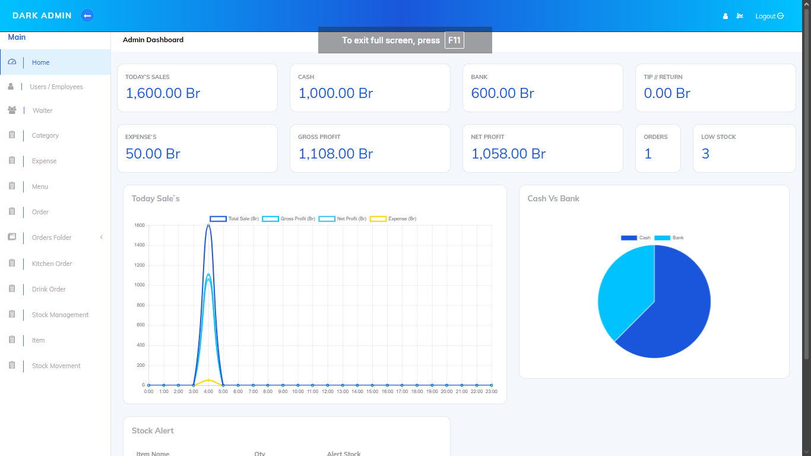
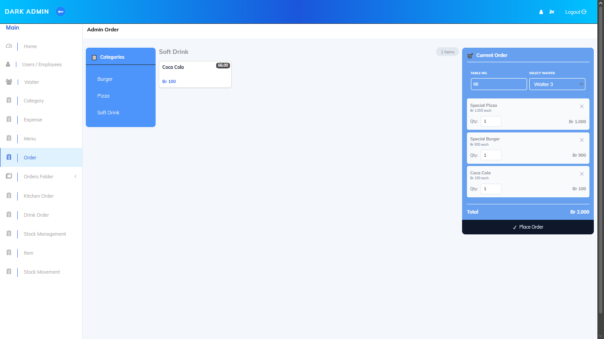
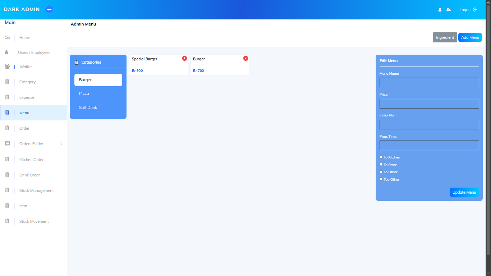
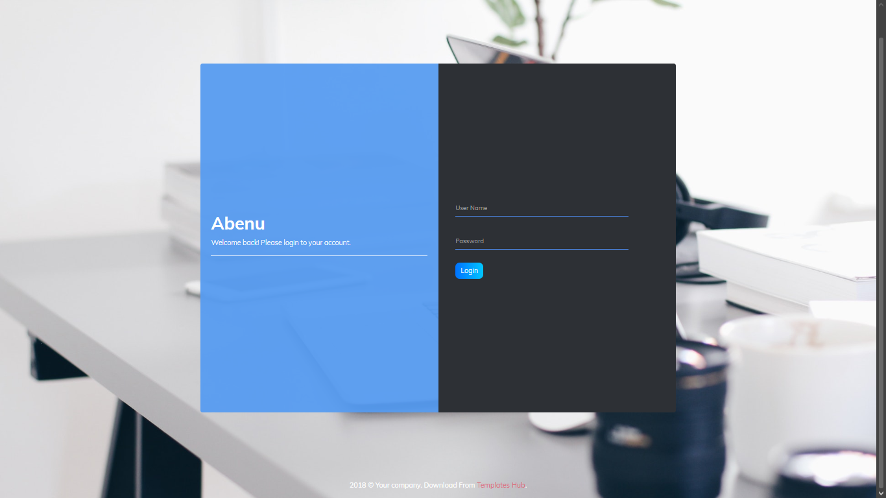

# Cafe Management System

🚧 **Project Status:** Under Development

📌 **Current Version:** v1.0.0 Beta

A full-stack web application designed to streamline cafe operations, including order management, customer handling, menu management, and reporting.

## Current Development Progress

This system is actively under development. New features, improvements, and bug fixes are being added continuously.

### Planned Features

* Enhanced reporting system
* Improved dashboard analytics
* Notification system
* Performance optimization
* Better UI/UX improvements

## Features

* User Authentication
* Dashboard Analytics
* Order Management
* Menu Management
* Customer Management
* Sales Reports
* REST API Integration

## Technologies Used

### Backend
- Laravel
- PHP

### Frontend
- Vue.js
- JavaScript
- HTML
- CSS

### Database
- MySQL

### API
- RESTful API

## Screenshots

### Dashboard


### Order Management


### Menu Management


### Login


## Important Note

This project is currently under active development and may receive regular updates, improvements, and bug fixes.

## Installation

### Clone Repository

```bash
git clone https://github.com/coolboy2309/Cafe-Management-System.git
```

### Install Backend Dependencies

```bash
composer install
```

### Install Frontend Dependencies

```bash
npm install
```

### Configure Environment

```bash
cp .env.example .env
```

Update database settings in `.env`

### Generate Application Key

```bash
php artisan key:generate
```

### Run Database Migrations

Import the SQL file from the Database sql folder into MySQL.

### Start Laravel Server

```bash
php artisan serve
```

### Start Frontend

```bash
npm run dev
```

## Project Highlights

- Developed a full-stack web application using Laravel and Vue.js.
- Designed and managed a MySQL database.
- Implemented RESTful APIs for communication between frontend and backend.
- Built responsive user interfaces.
- Managed authentication and authorization.


## Author

Abenezer Abadi
